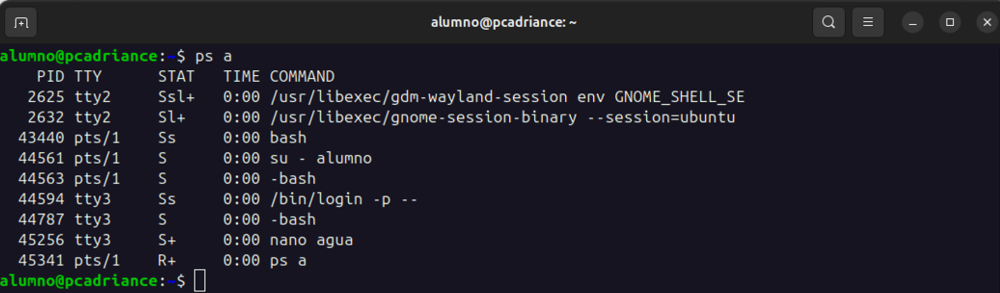

# MONITORIZACIÓN PROCESOS

## ps
El comando `ps` muestra información sobre los procesos en ejecución.

Con la opción `a` se muestran todos los procesos de todos los usuarios.
```bash	
ps a
```


Con `ps au` se muestra información sobre todos los procesos de todos los usuarios en formato largo.
```bash	
ps au
```


Con `ps aux` se muestra información sobre todos los procesos de todos los usuarios en formato largo y con información adicional.
```bash
ps aux
```


> [!TIP]
> Si quieres info sobre un proceso en concreto, puedes usar `ps -C <nombre>`
> ```bash
> ps -C nano
> ```
> 
> Parámetros interesantes: vsz (memoria virtual), rss (memoria física)

> [!NOTE]
> Si quieres ver los procesos que mas ocupen, por ejemplo, los 5 que mas ocupan memoria, puedes usar `ps -eo user,pid,%cpu,%mem,time --sort=-%cpu | head -n 6`
> 
> 

# Comando `top` y sus opciones en Linux

El comando `top` permite monitorear en tiempo real el uso de recursos del sistema, como CPU, memoria y procesos en ejecución.

## Opciones y atajos dentro de `top`

### `T` - Tiempo acumulado de los procesos
- Ordena los procesos según el **tiempo total de CPU acumulado** que han utilizado.
- Útil para identificar procesos que han consumido mucho tiempo de CPU durante su ejecución.

### `M` - Uso de memoria
- Ordena los procesos por la cantidad de **memoria RAM** que están utilizando.
- Ideal para localizar procesos que consumen demasiada RAM.

### `U` - Filtrar por usuario
- Permite mostrar los procesos de un **usuario específico**.
- Tras presionar `U`, se solicita el nombre de usuario.

### `p` - Ordenar por PID
- Ordena los procesos por su **ID de proceso** (PID).
- Es útil para localizar un proceso específico si conoces su PID.

### `P` - Uso de CPU
- Ordena los procesos por el **uso de la CPU** (de mayor a menor).
- Ayuda a identificar qué procesos están consumiendo más recursos de CPU.

### `N` - Orden por PID
- Igual que `p`, ordena los procesos por el **PID** en orden ascendente.

### `R` - Invertir el orden
- **Invierte el orden** de la columna seleccionada para ordenar.
- Por ejemplo, si los procesos están ordenados por PID, los muestra en orden descendente.

---

## Personalización en `top`
- Puedes usar estas teclas para ajustar el formato de la visualización según tus necesidades.
- Para guardar la configuración personalizada, presiona `W` (creará un archivo `.toprc` en tu directorio personal).

> [!NOTE]
>  `top -b -n 1 > top.txt`
> Genera una captura de top y guardar la informacion en un archivo


> [!TIP]
> `top -b -n 3 -o +%CPU | head -n 17`
> 10 procesos que más CPU consumen por periodos de 3 segundos


## htop

`htop` es una herramienta de monitoreo de procesos interactiva y colorida para sistemas Linux.

