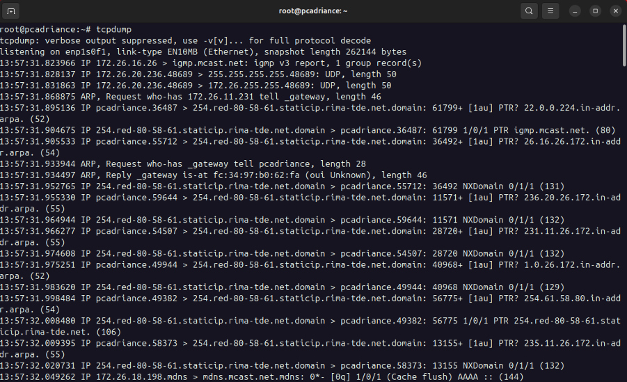
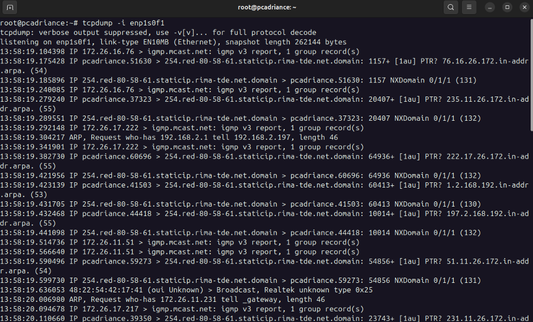
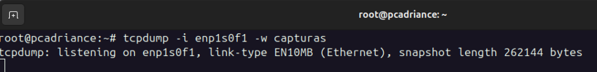
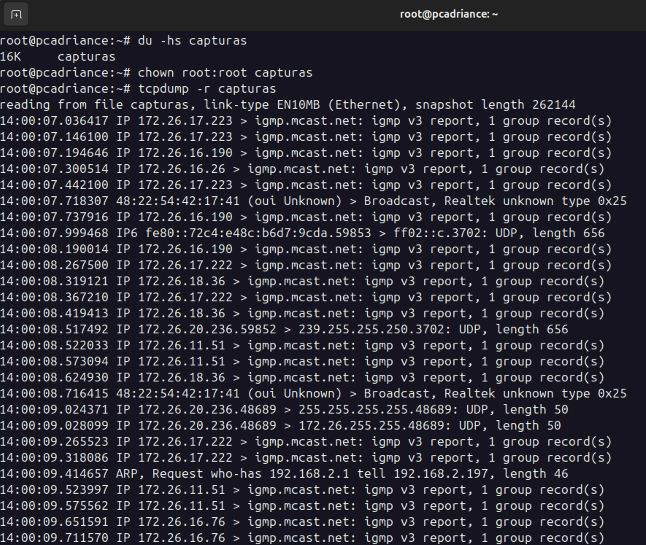
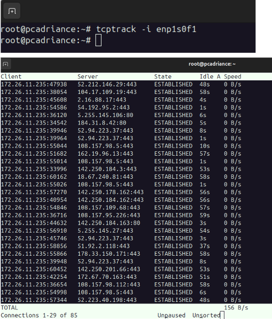
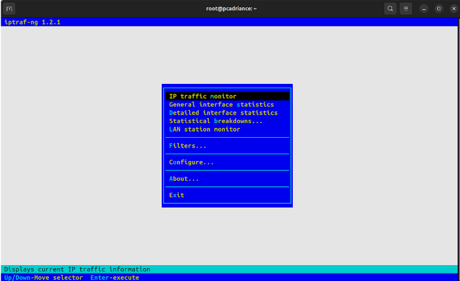
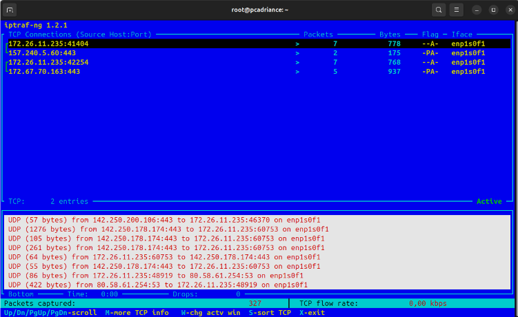
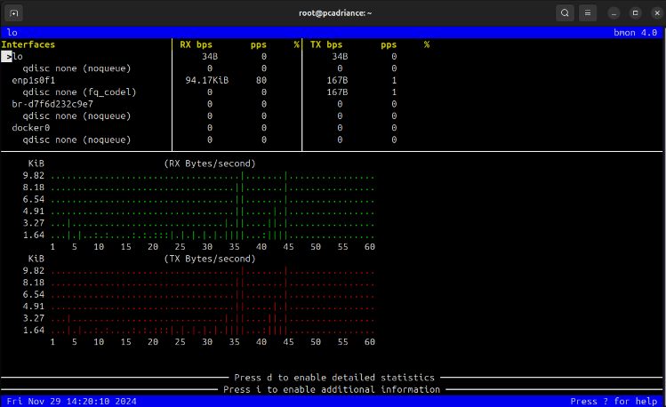

# MONITORIZACIÓN RED

# TCPDUMP

El comando `tcpdump` es una herramienta de línea de comandos que permite capturar y analizar paquetes de red en un sistema. Es muy útil para depurar problemas de red, analizar tráfico y realizar tareas de seguridad.



## TCPDUMP con tu tarjeta de red

Para capturar paquetes de red con `tcpdump`, necesitas especificar la interfaz de red que deseas monitorear. Puedes ver las interfaces de red disponibles en tu sistema con el comando `ifconfig` o `ip a`.

```bash
sudo tcpdump -i eth0
```



## TCPDUMP redirección a un archivo

Para guardar la salida de `tcpdump` en un archivo, puedes redirigir la salida a un archivo de texto.

```bash
sudo tcpdump -i eth0 -w capturas
```


Cambiamos de dueño el archivo con chown y usamos `tcpdump -r` para leer el archivo.

```bash
chown root:root capturas
tcpdump -r capturas
```


# TCPTRACK

`tcptrack` es una herramienta de línea de comandos que muestra el tráfico de red en tiempo real. Muestra información sobre conexiones TCP activas en un sistema, incluidas las direcciones IP, los puertos y el estado de la conexión.



# IPTRAF

para instalar
    
```bash
sudo apt install iptraf-ng
```




# BMON

para instalar

```bash
sudo apt install bmon
```
