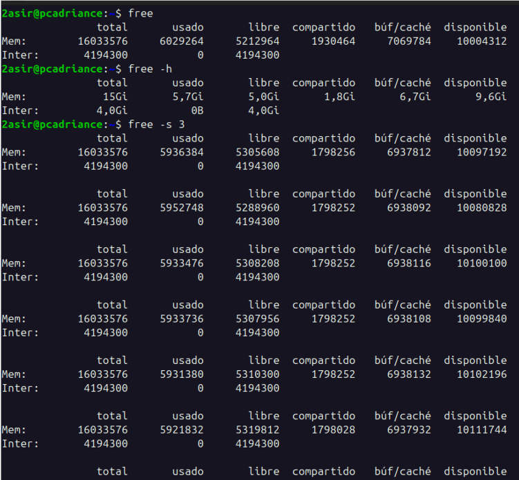
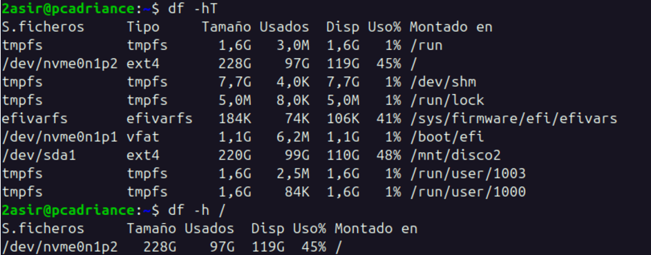
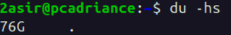
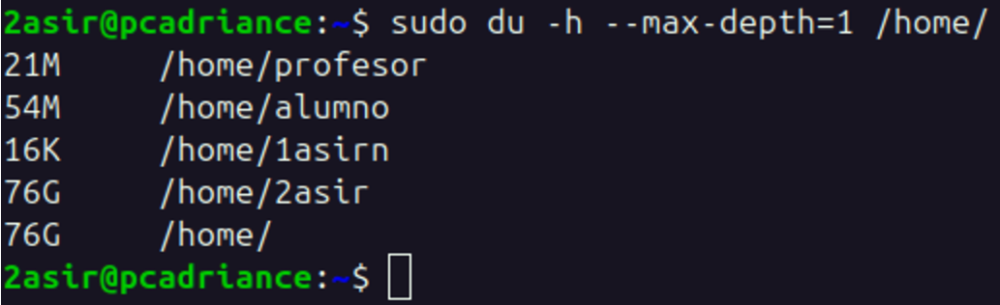
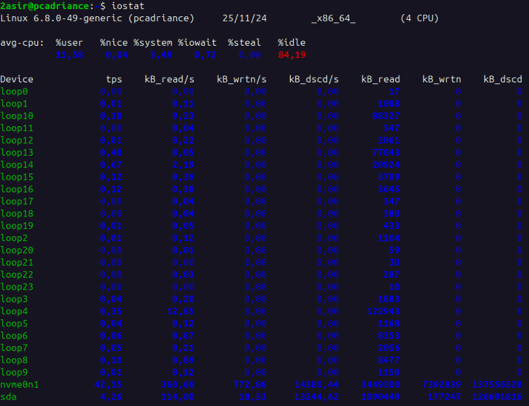
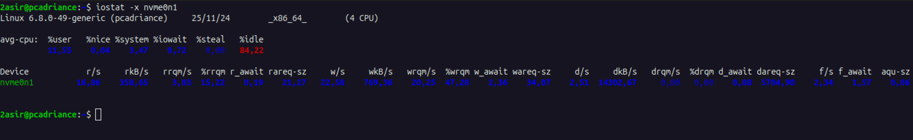
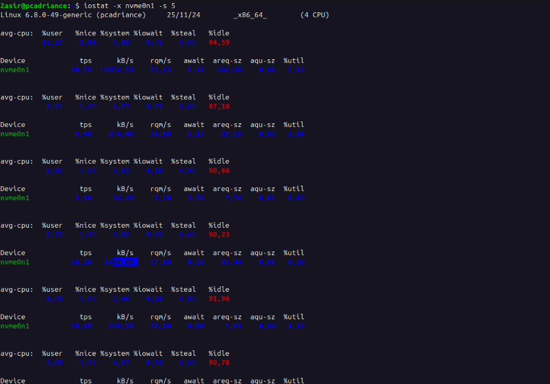

# MONITORIZACIÓN ALMACENAMIENTO

## free

El comando `free` muestra la cantidad de memoria libre y utilizada en el sistema.
Usando `free -h`, la salida se muestra en un formato más legible para el usuario.
Para verlo en intervalos de 3s por ejemplo, se puede usar `free -s 3`.



## ESPACIO

Con el comando `df`, se puede ver el espacio en disco disponible y utilizado en el sistema.Usando `df -hT`, se muestra el espacio en disco en un formato más legible para el usuario.Si quiero ver algun espacio en concreto, por ejemplo el de `/`, se puede usar `df -hT /`.



Si quiero calcular el espacio, por ejemplo, de un directorio en concreto, se puede usar `du -sh /directorio`.




> [!TIP] 
> Ver cantidad de uso por usuario /home
> ```bash
> du -h --max-depth=1 /home
>```
>

# iostat

El comando `iostat` muestra estadísticas de uso de CPU y dispositivos de E/S.



Con la opción `-x`, se muestra información extendida sobre las estadísticas de dispositivos de E/S.



> [!NOTE]
> Si quiero verlo en intervalos de 5s por ejemplo, se puede usar `iostat -x nvme0n1 -s 5`.

